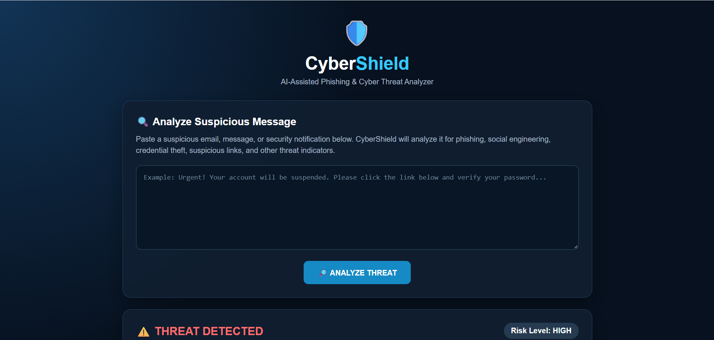
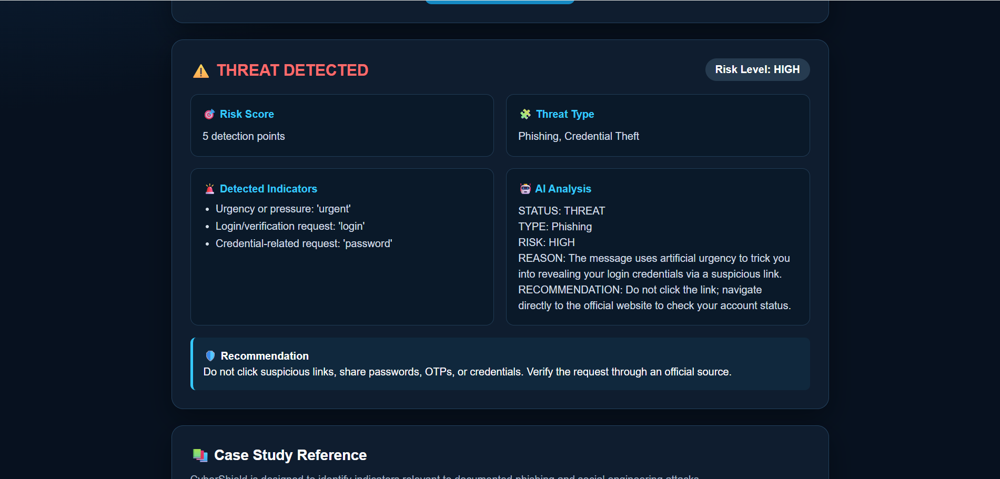
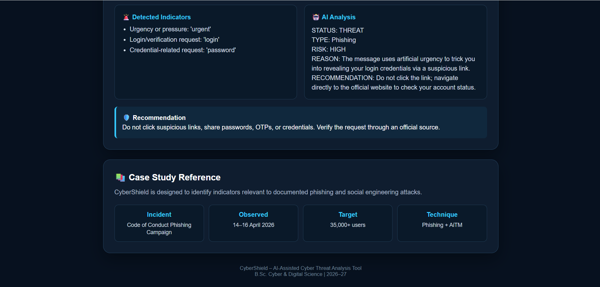
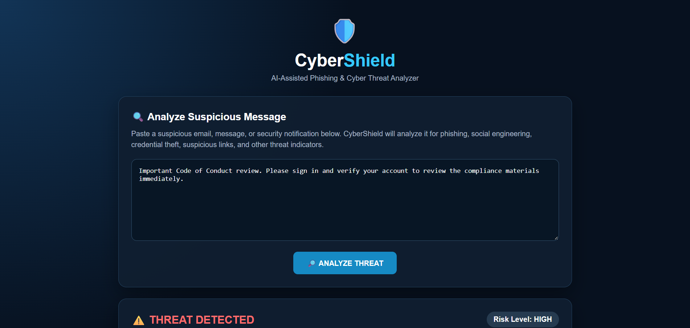
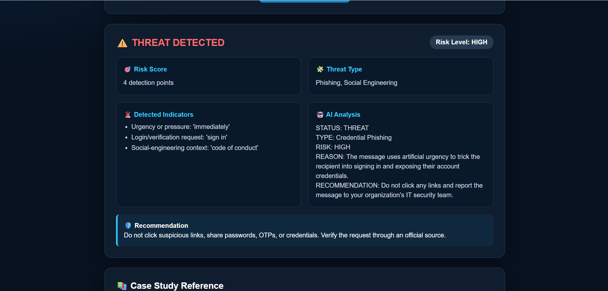

# 🛡️ CyberShield – AI-Assisted Phishing & Cyber Threat Analyzer

CyberShield is an AI-assisted cybersecurity tool designed to analyze suspicious emails, messages, and security notifications.

The tool combines rule-based threat detection with Google Gemini AI to identify possible phishing, social engineering, credential theft, and suspicious link indicators.

---

## 📌 Project Overview

CyberShield allows a user to paste a suspicious message and analyze it for common cybersecurity threat indicators.

The application provides:

- Threat status
- Risk level
- Risk score
- Threat type
- Detected indicators
- AI-based analysis
- Security recommendation

The project is designed as a learning-oriented cybersecurity tool and is inspired by documented phishing and social-engineering attack patterns.

---

## 🎯 Objectives

The main objectives of CyberShield are:

1. Detect common phishing indicators.
2. Identify social-engineering patterns.
3. Detect credential-related requests.
4. Identify suspicious URLs and domains.
5. Use AI to provide additional threat analysis.
6. Provide simple security recommendations to users.
7. Demonstrate practical cybersecurity concepts through a working tool.

---

## 🧰 Technologies Used

| Technology | Purpose |
|---|---|
| Python | Backend programming |
| Flask | Web application framework |
| Google Gemini AI | AI-based threat analysis |
| HTML | Frontend structure |
| CSS | User interface design |
| JavaScript | Frontend interaction |
| Fernet | Message encryption |
| Python-dotenv | Environment variable management |
| Git & GitHub | Version control and project hosting |

---

## 🔐 Security Features

### 1. Rule-Based Detection

CyberShield checks messages for indicators such as:

- Urgency and pressure
- Login requests
- Account verification
- Password requests
- OTP requests
- Suspicious links
- Suspicious domains
- Social-engineering terminology

### 2. AI-Assisted Analysis

Google Gemini AI analyzes the message for:

- Phishing
- Social engineering
- Credential theft
- Malicious links
- Account takeover attempts

### 3. Message Encryption

The submitted message is processed using Fernet encryption before analysis.

### 4. Risk Classification

The tool classifies messages into:

- LOW
- MEDIUM
- HIGH

---

# 🖥️ Screenshots

## 🏠 Home Page

### Home Page – Empty Analyzer



### Home Page – Suspicious Message Entered


---

## 🚨 Threat Detection

### Threat Detection Result


### Detected Indicators and Risk Score



### AI Threat Analysis



---

## 📚 Case Study Reference

### Case Study Section



### Documented Attack Context



### Phishing and AiTM Reference


---

# 🔬 Case Study

## Microsoft-Observed Code of Conduct Phishing Campaign

CyberShield was developed with reference to a documented phishing campaign involving fake Code of Conduct and compliance-related messages.

The documented campaign was observed during:

**14–16 April 2026**

The campaign involved phishing and Adversary-in-the-Middle (AiTM) techniques and targeted more than 35,000 users.

CyberShield does not reproduce the real attack. Instead, the case study is used to understand and detect similar phishing and social-engineering indicators.

---

# ⚙️ How CyberShield Works

```text
User enters suspicious message
            ↓
      Message Encryption
            ↓
     Rule-Based Detection
            ↓
        Gemini AI
            ↓
   Threat Result Generation
            ↓
 Status + Risk + Indicators
            ↓
 Security Recommendation

🚀 How to Run the Project
1. Clone the repository
git clone https://github.com/parmar-pooja-tech/CyberShield-Threat-Analyzer.git
2. Open the project
cd CyberShield-Threat-Analyzer
3. Create virtual environment
python -m venv venv
4. Activate virtual environment
Windows PowerShell
venv\Scripts\activate
5. Install dependencies
pip install -r requirements.txt
6. Configure Gemini API

Create a .env file in the project folder.

Add:

GEMINI_API_KEY=your_api_key_here

Do not upload the .env file to GitHub.

7. Run the application
python app.py

Then open:

http://127.0.0.1:5000

📂 Project Structure
CyberShield-Threat-Analyzer/
│
├── app.py
├── requirements.txt
├── README.md
├── .gitignore
├── .env.example
│
├── templates/
│   ├── index.html
│   ├── chat.html
│   ├── login.html
│   └── register.html
│
├── screenshots/
│   ├── home-1.png
│   ├── home-2.png
│   ├── threat-1.png
│   ├── threat-2.png
│   ├── threat-3.png
│   ├── case-study-1.png
│   ├── case-study-2.png
│   └── case-study-3.png
│
└── secret.key

⚠️ Limitations
AI analysis depends on Gemini API availability.
Free API usage may have request limits.
Rule-based detection may not detect every type of phishing attack.
The tool should be treated as an analysis aid, not as a replacement for professional security systems.
A message classified as SAFE should still be reviewed carefully when sensitive information is involved.
🔮 Future Enhancements

Possible future improvements include:

Email header analysis
URL reputation checking
Domain age and reputation analysis
Attachment scanning
Malware analysis integration
SIEM integration
Threat intelligence APIs
Browser extension support
Email security integration
Improved AI-based risk scoring
👩‍💻 Project

Project: CyberShield – AI-Assisted Phishing & Cyber Threat Analyzer

Field: Cybersecurity

Course: B.Sc. Cyber & Digital Science

Academic Year: 2026–27

📚 References
Microsoft Security – Documented Code of Conduct phishing campaign
Google Gemini API documentation
Flask documentation
Python Cryptography documentation
